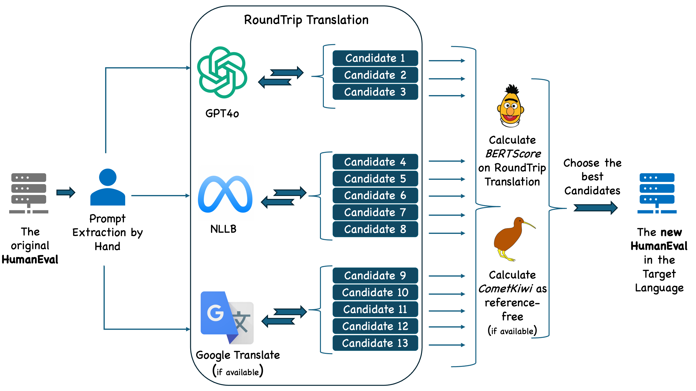
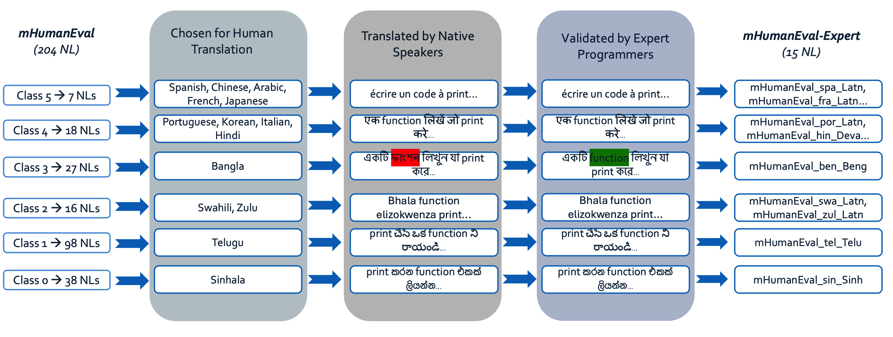
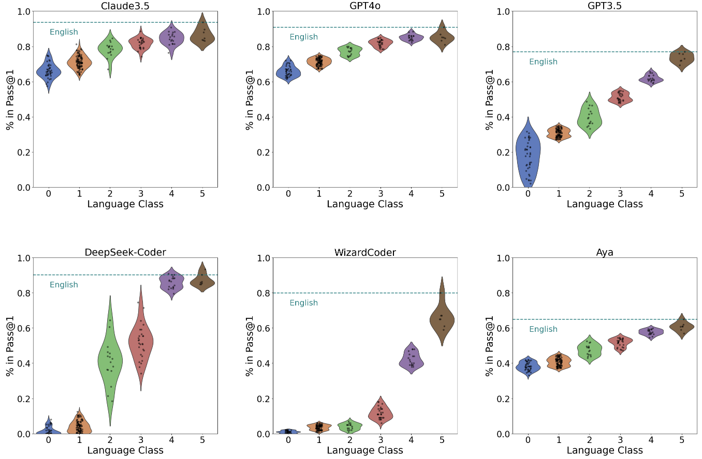

<div align="center">

  ## 🔷 **Accepted in NAACL Proceedings (2025)** 🔷

</div>


<div align="center">
<table>
<tr>
<td>
<a href="https://arxiv.org/abs/2410.15037">

</a>
</td>
<td>
<a href="mailto:mraihan2@gmu.edu">

</a>
</td>
</tr>
</table>
</div>

<div align="center">
  
  # **mHumanEval**

  

The mHumanEval benchmark is curated based on prompts from the original HumanEval 📚 [Chen et al., 2021]. It includes a total of 33,456 prompts, significantly expanding from the original 164. 
  
</div>


<div align="center">

  # **Quick Start**

  Detailed instructions and code are provided in the "Usage Guide" directory  

</div>

## Prerequisites

- Python 3.6 or higher
- Jupyter Notebook environment
- Downloaded benchmark files (CSV or JSON format)

1. Clone this repository:
   ```bash
   git clone https://github.com/mraihan-gmu/mHumanEval-Benchmark.git
   cd mHumanEval-Benchmark
   ```

2. Install requirements:
   ```bash
   pip install -r requirements.txt
   ```

3. Download the benchmark files to evaluate:
   - NL-specific benchmarks are in the `mHumanEval-{NL}` directory
   - PL-specific benchmarks are in the `mHumanEval-{PL}` directory

4. Open the evaluator notebook (In the 'Usage Guide' directory):
   ```bash
   jupyter notebook evaluate.ipynb
   ```

5. Update the configuration variables at the top of the notebook, then run the cell to evaluate the benchmark file:
   ```python
   # Update these variables to match your benchmark files
   CSV_FILE_NAME = 'mHumanEval-ben_Beng.csv'
   JSON_FILE_NAME = 'mHumanEval-ben_Beng.json'
   SOLUTION_COLUMN = 'canonical_solution'  # Important: Change this to the name of your column containing code solutions
   
   # The evaluation will run automatically when you execute the cell
   ```


---
<div align="center">

# **mHumanEval - Why?**

</div>
Recent advancements in large language models (LLMs) have significantly enhanced code generation from natural language prompts. The HumanEval Benchmark, developed by OpenAI, remains the most widely used code generation benchmark. However, this and other Code LLM benchmarks face critical limitations, particularly in task diversity, test coverage, and linguistic scope. Current evaluations primarily focus on English-to-Python conversion tasks with limited test cases, potentially overestimating model performance. While recent works have addressed test coverage and programming language (PL) diversity, code generation from low-resource language prompts remains largely unexplored. To address this gap, we introduce mHumanEval, an extended benchmark supporting prompts in over 200 natural languages. We employ established machine translation methods to compile the benchmark, coupled with a quality assurance process. Furthermore, we provide expert human translations for 15 diverse natural languages (NLs). We conclude by analyzing the multilingual code generation capabilities of state-of-the-art (SOTA) Code LLMs, offering insights into the current landscape of cross-lingual code generation.

---
<div align="center">

# **mHumanEval - How?**

</div>




**We have a total of 33,456 prompts in mHumanEval spanning 204 languages. Each prompt additionally supports 24 programming languages, bringing the total number of prompts to 836,400.**

We provide multiple subsets of the dataset for quick usability and interesting ablation studies. Separate subsets are available for each NL (Natural Language) and PL (Programming Language) in all possible combinations. Additionally, we create several variants for testing purposes:

- **mHumanEval-T500**: A subset consisting of the 500 highest-quality prompts based on BERTScore and CometKiwi.
- **mHumanEval-R500**: A randomly selected subset of 500 prompts.
- **mHumanEval-B500**: A subset of the 500 lowest-quality prompts.

These prompts are drawn from the curated mHumanEval, which compiles the best prompts from 13 candidates each. Finally, we produce **mHumanEval-mini**, a subset containing 204 prompts, with each prompt in a different language, selecting one prompt per language.

---
<div align="center">

# **mHumanEval - Expert**

</div>
The mHumanEval-Expert benchmark includes human translations of programming prompts in 15 languages from all six language classes. Native speakers with computer science backgrounds perform these translations, ensuring accurate interpretation of programming concepts. The curation process involves language selection, translation, and quality assessment. A comparison between human and machine translations shows similar quality, with minimal differences in evaluation metrics (BERTScore variations of ±0.02 and CometKiwi variations of ±0.03). The similarity in quality is attributed to the general nature of the content in the original HumanEval prompts, which contain limited specialized coding terminology. This observation suggests that for programming prompts with general descriptions, machine translation can achieve comparable quality to human translation across diverse languages.



---
<div align="center">

### NL Coverage


| **Class** | **Resource**    | **Total** | **mHumanEval** | **mHumanEval-Expert** |
|:---------:|:----------------|----------:|---------------:|----------------------:|
| 5         | High            |         7 |               7 |                      6 |
| 4         | Mid to High     |        18 |              18 |                      4 |
| 3         | Mid             |        28 |              27 |                      1 |
| 2         | Low to Mid      |        19 |              16 |                      2 |
| 1         | Low             |       222 |              98 |                      1 |
| 0         | Rare            |      2191 |              38 |                      1 |
| ALL       | --              |      2485 |             204 |                     15 |

**Table: Class distribution of natural languages based on resource availability. mHumanEval-Expert denotes human translations done by expert programmers.**

</div>

---

<div align="center">

### mHumanEval Subsets 📊


| **Subset**             | **Prompts** | **Note**        |
|------------------------|-------------|-----------------|
| **mHumanEval-{NL}**    | 164 each    | Each NL         |
| **mHumanEval-mini**    | 204         | 204 NLs         |
| **mHumanEval-T500**    | 500         | Top 500         |
| **mHumanEval-R500**    | 500         | Random 500      |
| **mHumanEval-B500**    | 500         | Bottom 500      |
| **mHumanEval-{PL}**    | 4100 each   | Each PL         |
| **mHumanEval-Expert**  | 2460        | Human Generated |
| **mHumanEval**         | 33,456      | Only Python     |
| **mHumanEval-Max**     | 836,400     | All Prompts     |


**Table: Subsets and Variants of mHumanEval.**

**Note:** Each subset and variant is designed to facilitate specific types of analysis and testing, ensuring comprehensive evaluation across different dimensions of the dataset.

</div>

---
<div align="center">


### LLMs Performance on mHumanEval

</div>

**Categorized by Language Classes [Joshi et al., 2020]**




---


<div align="center">
<h2>📚 Citation</h2>
</div>

If you find our work helpful, please consider citing our paper:

<div style="background-color: #f6f8fa; padding: 20px; border-radius: 5px; margin: 10px 0;">
<p style="margin-bottom: 10px;"><strong>mHumanEval: A Multilingual Benchmark to Evaluate Large Language Models for Code Generation</strong></p>

```bibtex
@article{raihan2024mhumaneval,
  title={mHumanEval--A Multilingual Benchmark to Evaluate Large Language Models for Code Generation},
  author={Raihan, Nishat and Anastasopoulos, Antonios and Zampieri, Marcos},
  journal={arXiv preprint arXiv:2410.15037},
  year={2024}
}
```


---
<div align="center">

## References 📚

</div>

```bibtex

@article{chen2021codex,
  title={Evaluating large language models trained on code},
  author={Chen, Mark and Tworek, Jerry and Jun, Heewoo and Yuan, Qiming and Pinto, Henrique Ponde de Oliveira and Kaplan, Jared and others},
  journal={arXiv preprint arXiv:2107.03374},
  year={2021}
}

@article{joshi2020state,
  title={The state and fate of linguistic diversity and inclusion in the NLP world},
  author={Joshi, Pratik and Santy, Sebastin and Budhiraja, Amar and Bali, Kalika and Choudhury, Monojit},
  journal={arXiv preprint arXiv:2004.09095},
  year={2020}
}

